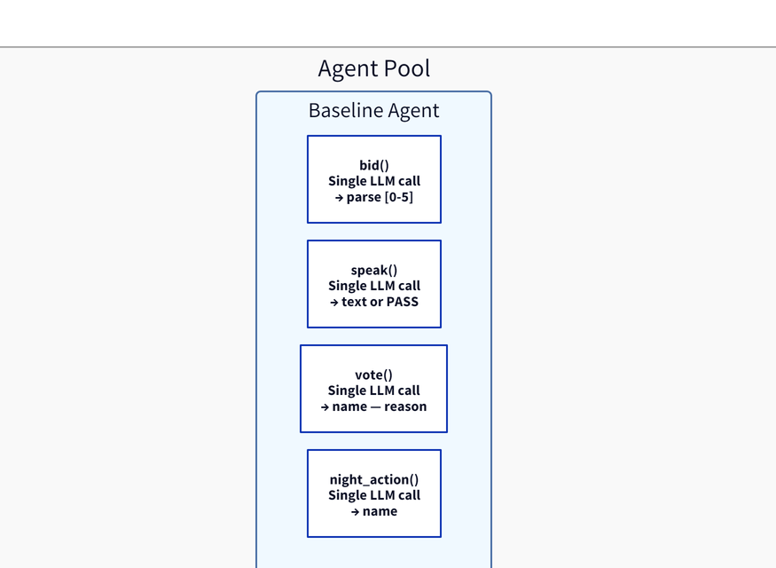
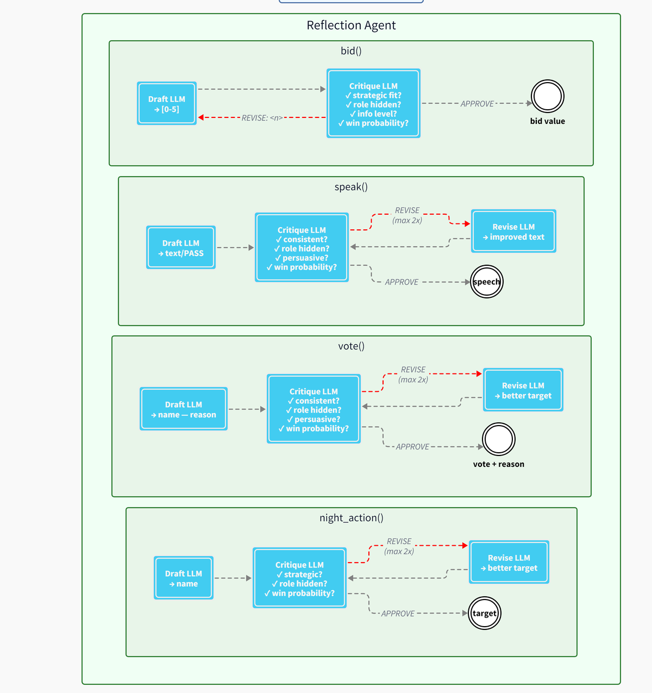
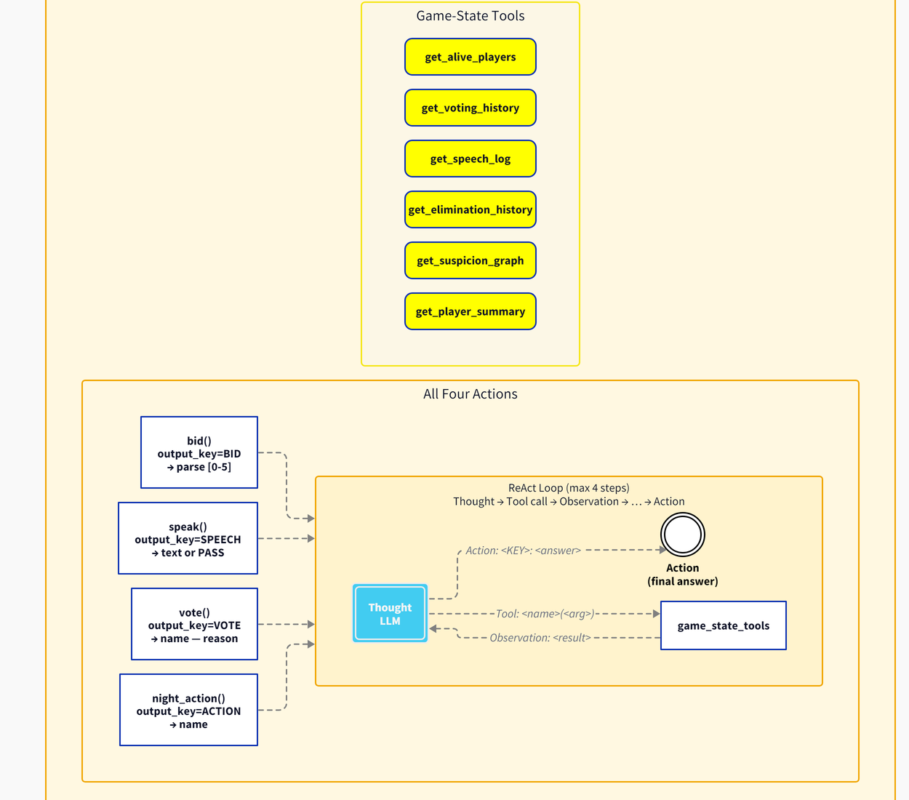
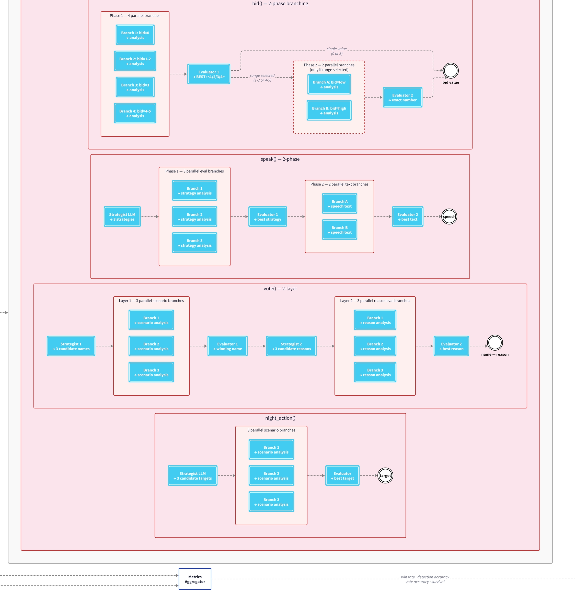
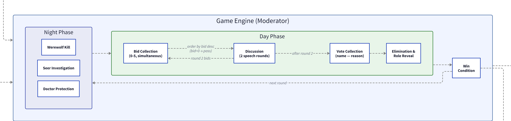

# Werewolf Agentic Arena

<details>
<summary>🇹🇷 Türkçe özet için tıklayın</summary>

**Amaç:** LLM modellerini ya da (model sabit tutulup) farklı agentic akıl yürütme mimarilerini karşılaştırmak için uygun, iyi kurulmuş bir Werewolf (Vampir Köylü) oyun dizaynı oluşturmak. Oyun; gizli bilgi, aldatma, koalisyon kurma ve çok turlu uzun vadeli akıl yürütme gerektirdiği için bu tür karşılaştırmalara elverişli, ama bunu gerçek bir kıyaslama ortamına çevirmek, oyunun kendisinin (bağlam zenginliği, araç seti, konuşma sırası) doğru kurulmasını gerektiriyor. Bu yüzden proje boyunca oyun dizaynı sabit tutulmadı, gözlemlenen oyuncu davranışına göre sürekli geliştirildi.

**4 mimari karşılaştırılıyor:** Baseline (kontrol grubu), Reflection (taslak → eleştiri → yeniden dene), ReAct (düşün → oyun durumu araçlarını sorgula → uygula), Tree of Thoughts (çoklu dal üretimi + değerlendirici seçimi).

**Tasarım süreç içinde gelişti:** Oyun durumu temsili (bağlam zenginliği) geliştikçe, oyuncu kalitesi de değişti. Aynı çağrı türü için (ToT oy stratejisi) prompt uzunluğu erken oyunlarda 781 token iken geç oyunlarda 3296 tokene çıktı. Somut bir örnek: geç bir oyunda Reflection deseniyle oynayan bir kurt adam (Carol), önce masum bir oyuncuyu ustaca hedef gösterip elettirdi, kendisi şüphelenilince aynı retorik hamleyi tam tersine çevirip şüphelenen kişiye karşı kullandı; çok turlu, tutarlı bir blöf.

**Durum: proje hâlâ devam ediyor.** Şu ana kadar 14 oyun oynandı (840 oyunluk dengeli tasarımın tamamı değil), bu bilinçli bir tercih: oyun tasarımı (prompt yapısı, araç seti, bağlam zenginliği) oturmadan önce büyük ölçekte oyun oynatmak, istatistiksel karşılaştırmayı anlamsız hale getirir. Mevcut 14 oyundan: Kurt Adamlar %71.4 kazandı (10/14), ToT bir oyunda Baseline'a göre ortalama ~3.8× daha fazla LLM çağrısı kullanıyor.

</details>

---

This project builds a Werewolf (Mafia) game design meant to work as a controlled benchmark: for comparing LLM models, or, holding the model fixed, different agentic reasoning architectures. The current phase does the latter: every agent in every game uses the same LLM, and the only variable is the agentic design pattern applied to it. Getting the game itself right (how much context each agent sees, what tools it has, how turn order works) turned out to be most of the work, since a benchmark is only as controlled as the environment it runs on. As the design settles, the same benchmark could shift toward the other axis, fixing the architecture and comparing models instead.

## Why Werewolf as a benchmark

Most agentic-architecture comparisons test different LLMs on one fixed architecture, or pit one new architecture against a couple of ad hoc baselines, and treat the game environment itself as a given. There's no controlled, published sweep of standard agentic patterns (Baseline, Reflection, ReAct, Tree of Thoughts) run on the same LLM in the same environment, which is the gap this project starts with. Werewolf is a strong candidate for either kind of comparison: it demands private information, deception, coalition-building, and reasoning that compounds across multiple rounds, the exact properties that separate both architectures and models from each other far more sharply than a single-turn QA benchmark would.

None of the reviewed literature iterates the environment while running the comparison. Werewolf Arena (Bailis et al., 2024) designed a genuinely new environment, including bidding-based turn order, but froze it and used it as a fixed tournament platform for comparing models. Bateni & Whitehead (FDG 2025) and Xu et al. (ICML 2024) ablate agent modules on an environment that stays fixed for the study. This project adopted pieces of both, Werewolf Arena's bidding for who speaks when, Xu et al.'s game-state design, and kept reshaping them as the comparison ran: building an environment fit for this kind of benchmark turned out to be as much of the work as the comparison itself.

## Four architectures compared

| Pattern | Mechanism |
|---|---|
| **Baseline** | Direct prompt to action. The control group. |
| **Reflection** | A generator LLM drafts an action, a critic LLM evaluates it for consistency, role safety, and persuasiveness, and retries if needed. |
| **ReAct** | Think, query the game-state tools (vote history, conversation log, survivors, suspicion graph, elimination history), observe, think again, act. |
| **Tree of Thoughts** | A generator produces multiple parallel branches per decision, an evaluator scores each, the best one wins. Applied separately to bidding, speaking, voting, and night actions. |

<table>
<tr>
<td align="center"><b>Baseline</b><br><a href="diagrams/baseline.png"></a></td>
<td align="center"><b>Reflection</b><br><a href="diagrams/reflection.png"></a></td>
<td align="center"><b>ReAct</b><br><a href="diagrams/react.png"></a></td>
<td align="center"><b>Tree of Thoughts</b><br><a href="diagrams/ToT.png"></a></td>
</tr>
</table>

<sub>Click any diagram to view it full size. Tree of Thoughts branches out this much for every single decision, bid, speech, vote, and night action alike, which is exactly why it costs 3.8x more LLM calls than Baseline.</sub>

<details>
<summary>See the full system architecture (game engine, tournament runner, and all four agents together)</summary>


</details>

## Game engine

8 players (2 werewolves, 1 seer, 1 doctor, 4 villagers). Each round: a night phase (werewolf kill, seer investigation, doctor protection), then a day phase (bid-based speaking order, adapted from Werewolf Arena's turn-taking design (Bailis et al., 2024), two rounds of discussion, a vote, an elimination). The rest of the environment design follows Xu et al. (ICML 2024), the methodology follows Wang et al. (ACL Findings 2024).



## Tournament design

A mixed arena: all 8 agent types share the table, in a combinatorial design balanced so each role gets played equally often. That works out to `C(8,2) x C(6,1) x C(5,1) = 840` unique role assignments for a fully balanced run.

**Metrics:** win rate by role, werewolf detection accuracy, average survival round, vote alignment, false accusation rate, role prediction F1 score.

## How the design evolved

This iteration is the direct evidence for the claim above, that building the environment was as much the point as running the comparison on it. The four agent architectures weren't the only thing changing between games; the game itself kept getting richer as the engine matured. The clearest evidence is in the prompts themselves: for the same call type (a Tree of Thoughts voting decision), the prompt carried 781 tokens of game-state context in an early game and 3,296 tokens in a later one, over four times as much history, speech, and derived state feeding into the same decision point.

Play quality changed along with it. In game 14, Carol (a werewolf, playing the Reflection pattern) spent several rounds steadily building a case against an innocent player, Frank: "his reluctance to name specific suspects and his passive contributions raise serious concerns," "it's clear that he has evaded scrutiny while the rest of us are actively engaging." Frank was voted out. When suspicion then turned toward Carol herself, she reused the exact same move in reverse, against her own accuser: "his eagerness to direct suspicion towards me feels suspicious... could this be a tactic to deflect attention from himself?" Recognizing that you've become the target and reflexively turning your own successful tactic back on the accuser is coherent, multi-round deception that would take a reasonably sharp human player to counter.

## Status: still in progress

14 games have been played so far, not the full 840-game balanced design. That's intentional. The prompt structure, the tool set, and how much game history each agent sees have all kept changing meaningfully between sessions, exactly the evolution described above, so pooling every game played so far into one statistical comparison would mix data from meaningfully different versions of the game. The results below are a directional first look, not a finished comparison. The next phase is to freeze the current design and run enough games under it for the per-architecture differences to be statistically meaningful rather than merely suggestive.

## Results so far

14 games played across all four patterns. Werewolves won 10 of them (71%), roughly in line with findings elsewhere in the LLM social deduction literature.

On cost: Tree of Thoughts uses about 3.8x more LLM calls than Baseline per game (59.0 versus 15.6 on average), and Reflection isn't far behind ToT in call volume (56.0 on average) despite being conceptually simpler. ReAct adds latency beyond what its call count alone would suggest, since each tool round-trip costs extra time (about 65 seconds versus 33 for Baseline, averaged per game).

A few qualitative observations stood out beyond the Carol example above: Seer information sharing worked as intended when the Seer chose to reveal, and vote justifications (recorded but not shown to other players) were consistently more candid than the public speeches, which is exactly the kind of signal this environment is designed to surface.

## Repository structure

```
werewolf-work/
├── game/          Game engine: state, engine, LLM abstraction layer
├── agents/         The 4 agent architectures (baseline, reflection, react, tot)
├── tournament/      Tournament runner, scheduler, logging
├── logs/           Game logs (JSON/JSONL), traces, session summaries
├── scripts/
│   ├── run/          Entry points to play games (run_one.py, run_test.py, run_tournament.py)
│   ├── analysis/      Post-hoc analysis (analyze.py, analyze_tokens.py, analyze_speech_order.py, show_game.py)
│   └── tests/         LLM backend connection checks (Bedrock, local LM Studio)
├── diagrams/         Architecture and per-pattern flow diagrams
├── docs/            Literature review
└── dashboard.py      Flask dashboard for browsing games, timelines, and API traces
```

## Tools

Python, LiteLLM (multi-provider LLM abstraction), the OpenAI SDK, AWS Bedrock (boto3), local LLM support via LM Studio, Flask, tiktoken for token counting.

## Academic references

- Wang et al., *"Boosting LLM Agents with Recursive Contemplation for Effective Deception Handling"*, ACL Findings 2024
- Xu et al., *"Language Agents with Reinforcement Learning for Strategic Play in the Werewolf Game"*, ICML 2024
- Bailis, Friedhoff, Chen, *"Werewolf Arena: A Case Study in LLM Evaluation via Social Deduction"*, arXiv:2407.13943
- Park et al., *"Generative Agents: Interactive Simulacra of Human Behavior"*, UIST 2023
- Arya et al., *"Revac: A Social Deduction Reasoning Agent"*, arXiv:2604.19523 (1st place, NeurIPS 2025 MindGames)

For the full literature review and reasoning, see [`docs/Wolfwere_Literature_Review.md`](docs/Wolfwere_Literature_Review.md).
